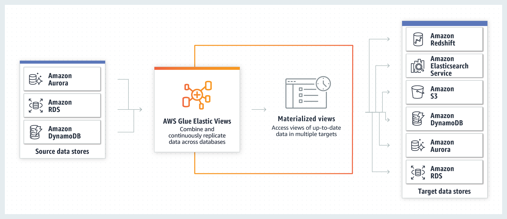
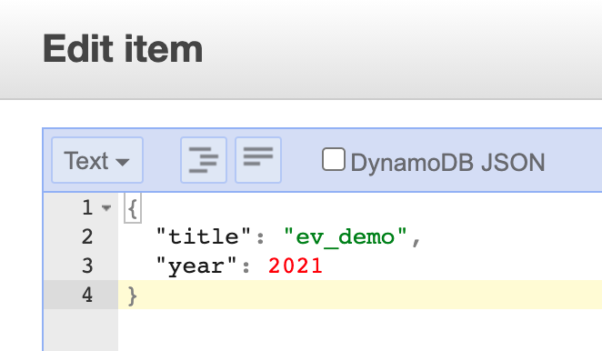
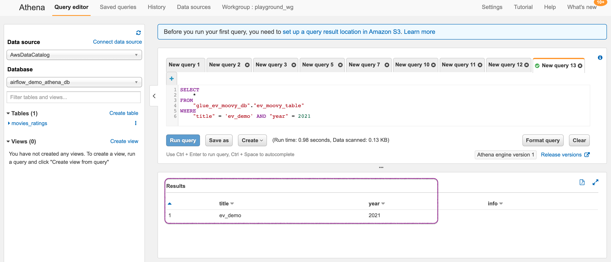

# AWS Glue Elastic Views - DynamoDB to S3 Materialization

AWS Glue Elastic Views enables you to replicate data across multiple AWS data stores to use with your applications without having to write custom code. With Elastic Views, you use Structured Query Language (SQL) compatible PartiQL queries to quickly create a view of the data you want to replicate from a different data store. Based on the view you create, Elastic Views replicates data from the source data store, and lets you materialized the view in a target data store.

As on today, Only DynamoDB is supported as the source and we can chose between three different destinations: `S3` or `ElasticSearch` or `Redshift`.


<sup>Image Credit: AWS Docs</sup>


This means, you can query your DynamoDB table with SQL like querying in(Athena/Redshift) or use the power of full text search offered by Elasticsearch. You can also extend this data by enriching it with data from other sources. Say for example, orders data in DynamoDB can be combined along with customer profile from another datastore.

_As of now(Q1 2021) this service is in preview. That means lots of new functionality will get added in the future and any limitations mentioned in those post may be removed in future._

## 🎯 Solutions

In this demo, lets us see how we can materialize data from DynamoDB to S3 and query them using Athena.


1.  ## ⚙️ Setting up the environment

    Let us a single region for all our resources - For example `us-east-1`

    - **DynamoDB Table**: We want to start with a very simple table that will have movies data. You can use the instruction provided in AWS Docs<sup>[1]</sup>. Let us call this table `ev-demo-movies-table`
      - `Primary Key/Partition Key` - `year` and type as `Number`
      - `Sort Key` -  `title` and type as `String`

      I have included some sample data, in this repo under the directory `sample_data/movie_data_01.json`. Ingest this data to the table. We will use this data to materialize in S3 later

    - **S3 Bucket**: Setup a bucket in the same region as the table. Let us call this bucket `ev-demo-bkt-010`

    - **IAM Role for Elastic Views**:
      We need a IAM role for Glue Elastic Views to write to our S3 bucket and a trust policy to allow the service to assume our role. Let us call this role `ev-demo-role`

      Here is the policy that you will need, do not forget to change the bucket name `YOUR_BUCKET_NAME_GOES_HERE` the target prefix name `YOUR_TARGET_PREFIX_NAME_GOES_HERE`
      ```json
      {
          "Version": "2012-10-17",
          "Statement": [
              {
                  "Effect": "Allow",
                  "Action": "s3:ListBucket",
                  "Resource": "arn:aws:s3:::YOUR_BUCKET_NAME_GOES_HERE"
              },
              {
                  "Effect": "Allow",
                  "Action": [
                      "s3:PutObject",
                      "s3:GetObject",
                      "s3:DeleteObject",
                      "s3:PutObjectAcl"
                  ],
                  "Resource": "arn:aws:s3:::YOUR_BUCKET_NAME_GOES_HERE/YOUR_TARGET_PREFIX_NAME_GOES_HERE/*"
              }
          ]
      }
      ```

      Likewise here is the trust policy

      ```json
      {
        "Version": "2012-10-17",
        "Statement": [
          {
            "Sid": "",
            "Effect": "Allow",
            "Principal": {
              "Service": "materializedviews.amazonaws.com"
            },
            "Action": "sts:AssumeRole"
          }
        ]
      }
      ```

1.  ## 🚀 Configure Glue Elastic Views

    _As of Q1 2021, you need to request preview access to Glue ElasticViews_

    1. **Source Configurations: DynamoDB**
        - AWS Console > Elastic Views > https://console.aws.amazon.com/elasticviews
        - Choose **Tables**
          - In the tables list, choose the _link_ to the **ev-demo-movies-table.ev-demo-movies-table** table.
          - On the table summary page, choose **ACTIVATE**. This operation can take a few minutes to complete.
            - My _assumption_ is that a _Kinesis Data Streams for DynamoDb_ is being setup in the background

    1. **Create View**
        - AWS Console > Elastic Views > https://console.aws.amazon.com/elasticviews
        - Choose **Tables**
          - In the tables list, choose the _link_ to the **ev-demo-movies-table.ev-demo-movies-table** table.
        - **View Name** - For example `ev-demo-view-s3`
        - **Provenance** - `year, title`
        - In Query editor, specify,
          ```SELECT CAST(year AS int4), title FROM ev-demo-movies-table.ev-demo-movies-table;``` 
        - Choose **Create view**

    1. **Start View**
        - AWS Console > Elastic Views > https://console.aws.amazon.com/elasticviews
        - Choose **Views**
          - In the views list, choose the link to the **ev-demo-view-s3** view
        - On the view summary page, choose **ACTIVATE**

    1. **Materialize View**
        - AWS Console > Elastic Views > https://console.aws.amazon.com/elasticviews
        - Choose **Views**
          - In the views list, choose the link to the **ev-demo-view-s3** view
        - On the view summary page, choose **Materialize View**
        - Choose **Materialize a view using AWS Glue EV**
        - Choose **Add target**
        - On the Add target page, choose **S3** as the target service > **Target location**,
          - **Location for materialized view** > `s3://ev-demo-bkt-010`
          - For encryption use default encryption
          - For Permission, choose the role we created earlier > `ev-demo-role`
        - **Target Name** > enter **moviespath**
          - Elastic Views creates this folder in this location, and places the _Parquet_ files and the manifest there when it materializes the view.
        - Choose **Add target** > Verify **Data type compatibility** is without any errors.
        - After all data types are compatible, choose **Materialize view** to finalize the materialization.

        After a few minutes check the S3 bucket prefix path `moviespath`, you will find parquet files - `part-00000-1303f-25cd-4670-a16b-49e29-c000.snappy.parquet` and the manifest file

  
    1. **Query Materialize View**

        We will use Athena to query our data in S3. Let us begin by creating a database and table to query the movies.
        - Access Athena Console > Query Editor >

          ```sql
          CREATE DATABASE ev-demo-movies-db;
          ```
        - Create an external table in Athena, and configure it to point to your Amazon S3

          ```sql
            CREATE EXTERNAL TABLE ev-demo-materialized-table(
            title STRING,
            year INT
            )
            ROW FORMAT SERDE 'org.apache.hadoop.hive.ql.io.parquet.serde.ParquetHiveSerDe'
            STORED AS INPUTFORMAT 'org.apache.hadoop.hive.ql.io.SymlinkTextInputFormat'
            OUTPUTFORMAT 'org.apache.hadoop.hive.ql.io.HiveIgnoreKeyTextOutputFormat'
            LOCATION 's3://ev-demo-bkt-010/moviespath/_symlink_format_manifest/'
          ```
        - Query the table

          ```sql
          select * from ev-demo-materialized-table limit 10;
          ```

        At this point, we have materialized view working.

1.  ## 🔬 Testing the solution

    Let us try to insert a new item into the source DynamoDB table. In my example, I added a item with `title` as `ev_demo` and `year` as `2021`

    

    Wait for about a minutes and rerun the query on the materialized view, and check for the corresponding new item in the Amazon S3 target data store. Changes you make to relevant data at the source appear in the target in near-real time. If you don't see the changes immediately, try running the query again.

    

    You can observe that the new items can be queried from the materialized view in S3.


1.  ## 📒 Conclusion

    Here we have demonstrated how to use Glue Elastic view to materialize views from DynamoDB to S3. You can extend this further by enriching the item with data from other sources using Glue workflows.

1.  ## 🧹 CleanUp

    If you want to destroy all the resources created by the stack, Execute the below command to delete the stack, or _you can delete the stack from console as well_

    - Resources created during [Deploying The Application](#-deploying-the-application)
    - Delete CloudWatch Lambda LogGroups
    - _Any other custom resources, you have created for this demo_

    ```bash
    # Delete from cdk
    cdk destroy

    # Follow any on-screen prompts

    # Delete the CF Stack, If you used cloudformation to deploy the stack.
    aws cloudformation delete-stack \
      --stack-name "MiztiikAutomationStack" \
      --region "${AWS_REGION}"
    ```

    This is not an exhaustive list, please carry out other necessary steps as maybe applicable to your needs.

## 📌 Who is using this

This repository aims to show how to use Glue Elastic view to materialize views to new developers, Solution Architects & Ops Engineers in AWS. Based on that knowledge these Udemy [course #1][102], [course #2][101] helps you build complete architecture in AWS.

### 💡 Help/Suggestions or 🐛 Bugs

Thank you for your interest in contributing to our project. Whether it is a bug report, new feature, correction, or additional documentation or solutions, we greatly value feedback and contributions from our community. [Start here](/issues)

### 👋 Buy me a coffee

[](https://ko-fi.com/Q5Q41QDGK) Buy me a [coffee ☕][900].

### 📚 References

1. [Docs: How to create DynamoDB][1]


### 🏷️ Metadata


**Level**: 200

[1]: https://docs.aws.amazon.com/amazondynamodb/latest/developerguide/getting-started-step-1.html

[100]: https://www.udemy.com/course/aws-cloud-security/?referralCode=B7F1B6C78B45ADAF77A9
[101]: https://www.udemy.com/course/aws-cloud-security-proactive-way/?referralCode=71DC542AD4481309A441
[102]: https://www.udemy.com/course/aws-cloud-development-kit-from-beginner-to-professional/?referralCode=E15D7FB64E417C547579
[103]: https://www.udemy.com/course/aws-cloudformation-basics?referralCode=93AD3B1530BC871093D6
[899]: https://www.udemy.com/user/n-kumar/
[900]: https://ko-fi.com/miztiik
[901]: https://ko-fi.com/Q5Q41QDGK
